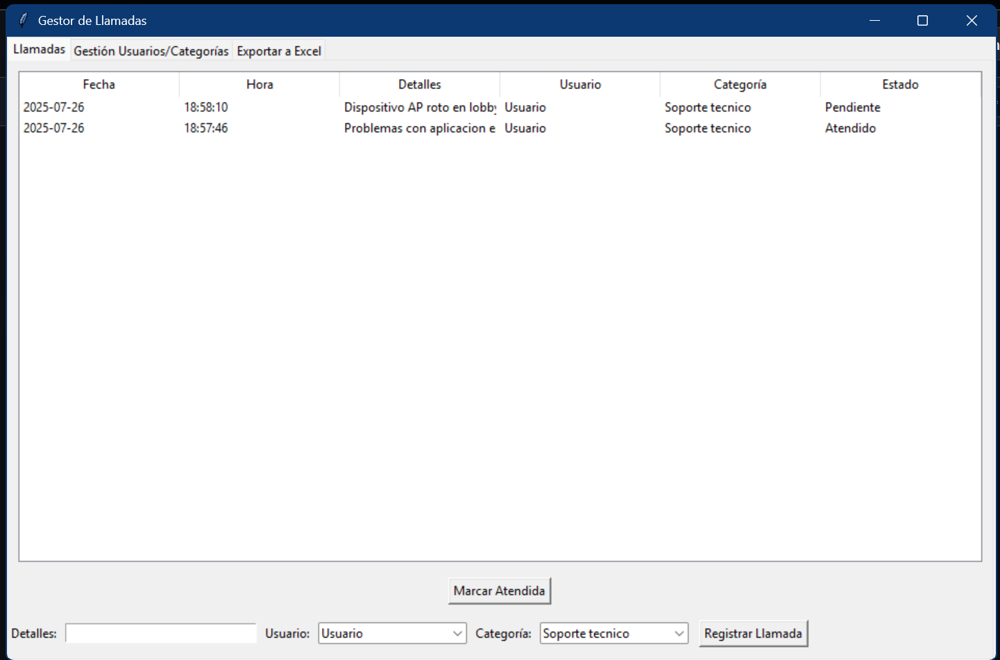
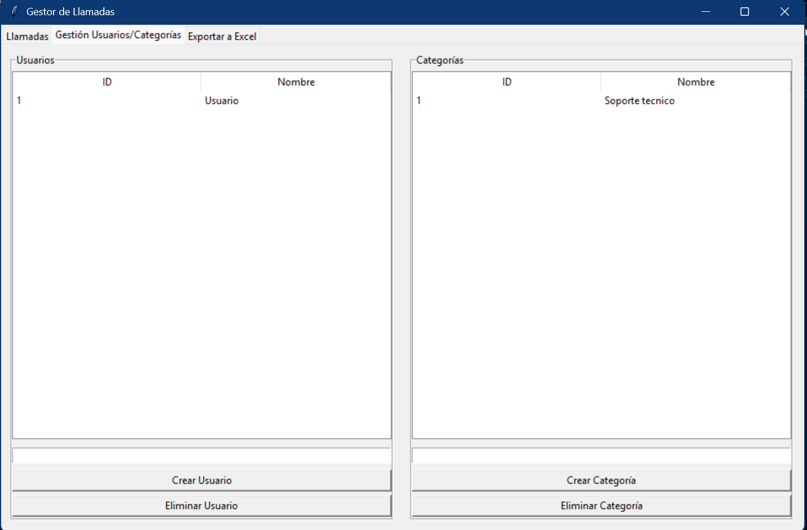
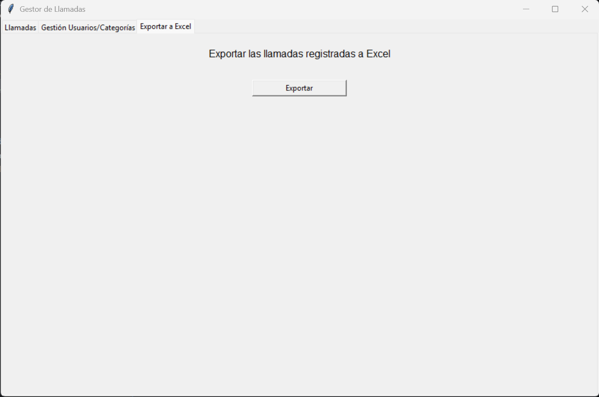
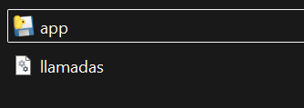

# RegistroSoporte
Un mini codigo para registrar actividades de atencion a cliente de forma rapida.

### Feo pero funcional

Permite registrar llamadas de soporte junto con el usuario que la atendio y poder exportarlo en formato excel.

## Registro de llamadas
 Permite registrar la hora y fecha exacta del registro de la llamada solo seleccionando el usuario que la recibio y la categoria

 

+ Registra las llamadas y se quedan pendientes
+ Se puede actualizar el estado de una llamada cuando se completa la atencion

## Registro de usuarios

+ Permite registrar los usuarios que dan atencion
+ Permite registrar las diversas categorias de llamadas

## Exportar a excel 

Permite exportar la informacion a tablas de exel con el mismo orden y formato 

# Como Ejecutar?

El archivo es un ejecutable basico, que a la hora de que se activa por primera vez genera un archivo sqlite para almacenar los datos historicos

No necesita dependencias extras o python, solo estar en la misma carpeta donde esta el archivo de base de datos