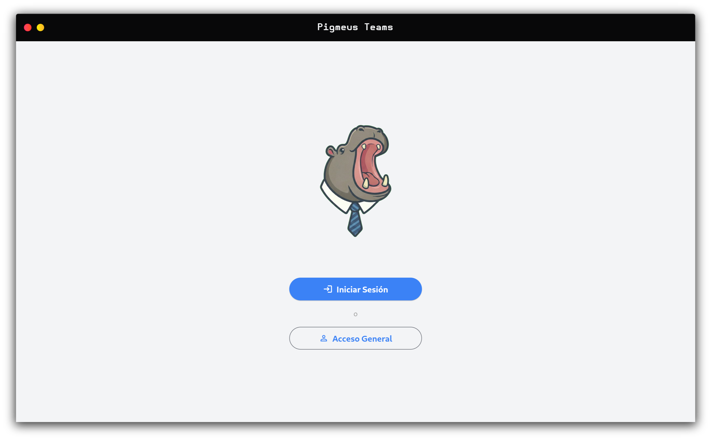
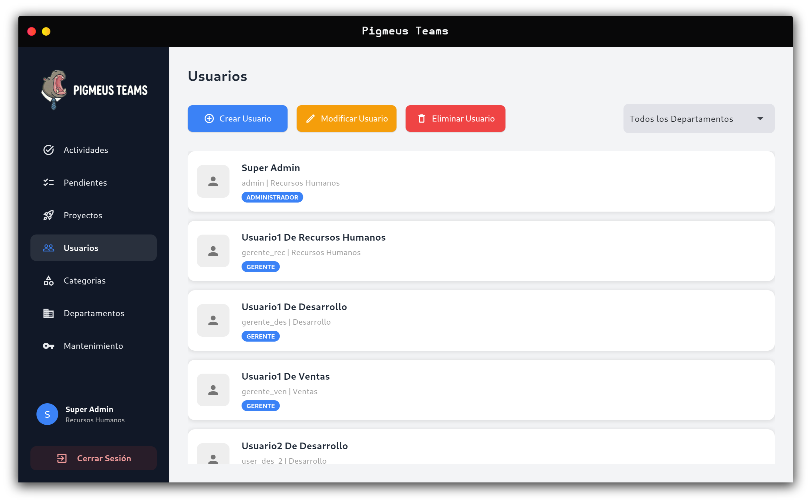
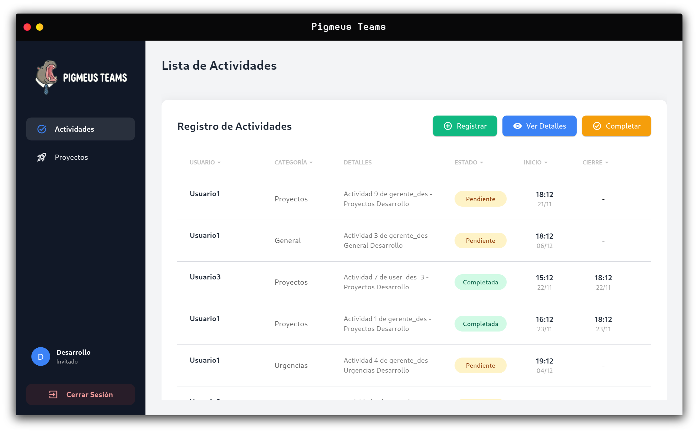

# Pigmeus Pro (Flet Version)

> [!WARNING]
> **PROYECTO ACTUALMENTE INCOMPLETO / WORK IN PROGRESS**
> Este proyecto se encuentra en una etapa activa de desarrollo. Muchas funcionalidades pueden cambiar o no estar completamente implementadas.

Un sistema moderno para la gestión de actividades, usuarios y proyectos, reescrito completamente utilizando **Flet** para una interfaz responsiva y **PostgreSQL** para una gestión robusta de datos.

## 📋 Descripción

Pigmeus Pro es una herramienta diseñada para registrar y dar seguimiento a actividades de soporte y gestión interna. A diferencia de la versión anterior, esta iteración utiliza una arquitectura cliente-servidor más robusta y una interfaz de usuario moderna y fluida.

## ✨ Características Principales

*   **Gestión de Actividades**: Registro detallado de actividades con control de tiempos y estados.
*   **Gestión de Usuarios y Roles**: Administración de usuarios con diferentes niveles de acceso (Administrador, Gerente, Básico).
*   **Departamentos y Proyectos**: Organización jerárquica de tareas por departamentos y proyectos específicos.
*   **Sistema de Pendientes**: Módulo dedicado para el seguimiento de tareas pendientes.
*   **Colaboración**: Soporte para múltiples colaboradores en una misma actividad.
*   **Interfaz Moderna**: UI construida con Flet, ofreciendo una experiencia de usuario limpia y reactiva.

## 🛠️ Tecnologías Utilizadas

*   **Lenguaje**: [Python](https://www.python.org/) (3.9+)
*   **Framework UI**: [Flet](https://flet.dev/) (v0.28.3)
*   **Base de Datos**: [PostgreSQL](https://www.postgresql.org/)
*   **ORM**: [SQLAlchemy](https://www.sqlalchemy.org/)
*   **Driver DB**: `psycopg2`

## 📸 Capturas de Pantalla

### Inicio de Sesión


### Gestión de Usuarios


### Panel de Actividades


## 🚀 Cómo Ejecutar el Proyecto

### Prerrequisitos
1.  Tener Python instalado.
2.  Tener una instancia de PostgreSQL corriendo.
3.  Configurar la base de datos en `fletApp/src/db/database.py`.

### Instalación de Dependencias

```bash
pip install flet sqlalchemy psycopg2
```

### Ejecución

Navega a la carpeta del proyecto y ejecuta el archivo principal:

```bash
cd fletApp/src
python main.py
```
